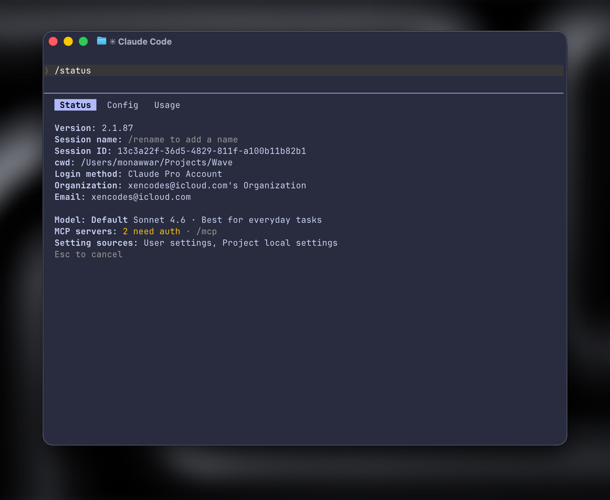

If you use Claude Code for both personal and work accounts, logging in and out gets old fast.
The cleaner setup is to give each account its own config directory. Claude stores local auth and session state there, so separate directories act like separate profiles.
The result is simple:

- `claude` can stay on your default account
- `claude-work` can open your work account
- no repeated sign-in/sign-out cycle

## How it works

Claude Code can be launched with a custom `CLAUDE_CONFIG_DIR`.

Example:

```bash
CLAUDE_CONFIG_DIR="$HOME/.claude-work" claude
```

When you do that, Claude uses `~/.claude-work` instead of the default config directory. That means auth, session history, and local state stay isolated from your main account.

## Fish setup

If you use `fish`, add this to `~/.config/fish/config.fish`:

```bash
function claude-work
    env CLAUDE_CONFIG_DIR="$HOME/.claude-work" claude $argv
end
```

Reload your shell:

```bash
source ~/.config/fish/config.fish
```


## Zsh setup

If you use `zsh`, add this to `~/.zshrc`:

```bash
alias claude-work='CLAUDE_CONFIG_DIR="$HOME/.claude-work" claude'
```

Reload your shell:

```bash
source ~/.zshrc
```

## Create the separate profile directory

Run this once:

```bash
mkdir -p ~/.claude-work
```

Then start the isolated profile with:

```bash
claude-work
```

The first time it opens, log into your work account inside that profile.

## What your final workflow looks like

Once setup is done:

- `claude` uses your default profile
- `claude-work` uses your work profile

That gives you clean switching between accounts without cross-contaminating local state.

## Scaling to more than two accounts

This pattern works for any number of accounts or clients.
Examples:

```bash
CLAUDE_CONFIG_DIR="$HOME/.claude-client-a" claude

CLAUDE_CONFIG_DIR="$HOME/.claude-client-b" claude

CLAUDE_CONFIG_DIR="$HOME/.claude-lab" claude
```

You can wrap each one in a shell alias or function:
- `claude-work`
- `claude-acme`
- `claude-prod`

## One useful safety check

After launching a profile, run `/status` inside Claude to confirm which account and session you are using.



That is the easiest way to avoid doing work in the wrong account.

## Why this setup is worth it

- no repeated login/logout flow
- separate local state per account
- cleaner personal vs work separation
- easy to remember and easy to extend


If you manage multiple Claude Code identities on one laptop, this is the simplest setup that stays practical.
